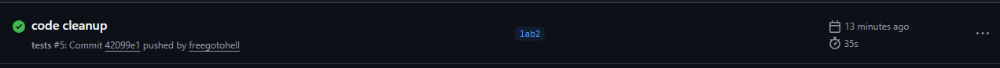

# Разработка корпоративных приложений — лабораторная работа №2

## «Сервер — REST API»

В рамках второй лабораторной работы для предметной области автосервиса реализовано серверное приложение с использованием **ASP.NET Core Web API**.

Сервер предоставляет REST API для выполнения CRUD-операций над сущностями первой лабораторной работы, операций получения связанных данных и аналитических запросов.

Данные по-прежнему хранятся **в памяти в виде коллекций**.

Вариант: 57

---

## Предметная область

Проект моделирует работу автомобильного сервиса.

### Основные сущности

| Класс | Назначение |
|---|---|
| `Client` | Клиент автосервиса |
| `Car` | Автомобиль клиента |
| `Mechanic` | Механик автосервиса |
| `WorkType` | Вид выполняемой работы |
| `RepairOrder` | Заказ на ремонт |
| `OrderWork` | Связь заказа с выполняемой работой |
| `OrderMechanic` | Связь заказа с механиком |

### Перечисления

Перечисления вынесены в отдельный проект `AutoService.Domain.Shared`.

`MechanicSpecialization` — специализация механика:

- `Engine`
- `Transmission`
- `Electrical`
- `Diagnostics`
- `BodyRepair`

`WorkCategory` — категория работы:

- `Engine`
- `Transmission`
- `Electrical`
- `Diagnostics`
- `BodyRepair`
- `Maintenance`

`Maintenance` используется для общих регламентных работ. При подборе механиков такая категория может быть сопоставлена с несколькими специализациями.

Для результатов удаления используется `DeleteResult`:

- `Deleted`
- `NotFound`
- `HasRelatedEntities`

Сущность не удаляется, если её удаление нарушило бы историю ремонтных заказов.
---

## Связи между сущностями

Основные связи предметной области:

```text
Client
 └── Car
      └── RepairOrder
           ├── OrderWork ─── WorkType
           └── OrderMechanic ─── Mechanic
```

- один `Client` может иметь несколько автомобилей;
- один `Car` может иметь несколько заказов на ремонт;
- `RepairOrder` связан с клиентом и автомобилем;
- заказ может содержать несколько работ через `OrderWork`;
- заказ может быть связан с несколькими механиками через `OrderMechanic`.

---

## REST API

Для основных сущностей реализован полный CRUD.

### Clients

```text
GET    /api/clients
GET    /api/clients/{id}
POST   /api/clients
PUT    /api/clients/{id}
DELETE /api/clients/{id}
```

Дополнительные запросы:

```text
GET /api/clients/{clientId}/cars
GET /api/clients/{clientId}/repairorders
GET /api/clients/repeated
```

### Cars

```text
GET    /api/cars
GET    /api/cars/{id}
POST   /api/cars
PUT    /api/cars/{id}
DELETE /api/cars/{id}
```

Дополнительный запрос:

```text
GET /api/clients/{clientId}/cars
```

### Mechanics

```text
GET    /api/mechanics
GET    /api/mechanics/{id}
POST   /api/mechanics
PUT    /api/mechanics/{id}
DELETE /api/mechanics/{id}
```

Дополнительные запросы:

```text
GET /api/mechanics/{mechanicId}/clients
GET /api/mechanics/{mechanicId}/repairorders
GET /api/worktypes/{workTypeId}/mechanics
GET /api/mechanics/by-specialization?specialization=Engine
```

### WorkTypes

```text
GET    /api/worktypes
GET    /api/worktypes/{id}
POST   /api/worktypes
PUT    /api/worktypes/{id}
DELETE /api/worktypes/{id}
```

Дополнительные запросы:

```text
GET /api/worktypes/{workTypeId}/repairorders
GET /api/worktypes/top5
```

### RepairOrders

```text
GET    /api/repairorders
GET    /api/repairorders/{id}
POST   /api/repairorders
PUT    /api/repairorders/{id}
DELETE /api/repairorders/{id}
```

Дополнительные запросы:

```text
GET /api/clients/{clientId}/repairorders
GET /api/cars/{carId}/repairorders
GET /api/mechanics/{mechanicId}/repairorders
GET /api/worktypes/{workTypeId}/repairorders
GET /api/repairorders/{id}/totalcost
```


---

## Unit-тесты

Тесты находятся в проекте `AutoService.Tests`.

### `DomainTests`

Проверяют корректность тестовых данных и основных связей предметной области.

### `QueriesTests`

Сравнивают результаты аналитических LINQ-запросов и результаты их реализации через сервисы.

---

## Тестовые данные

Для генерации тестовых данных используется `DataSeeder`.

Начальный набор данных содержит:

- 10 клиентов;
- 10 автомобилей;
- 10 механиков;
- 10 видов работ;
- 20 заказов на ремонт.


---

## Запуск проекта

```powershell
dotnet run --project .\AutoService.Api
```

---

## Результаты

